# Augmentations for Digit 4

## Original Image

## Rotation Augmentation
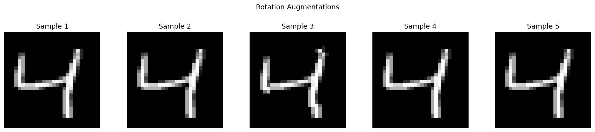

### Individual Samples
 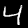 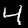 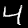  

## Affine Augmentation
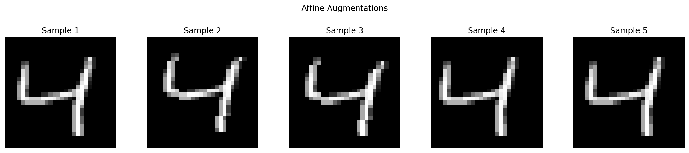

### Individual Samples
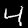 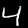 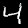 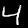 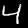 

## Combined Augmentation
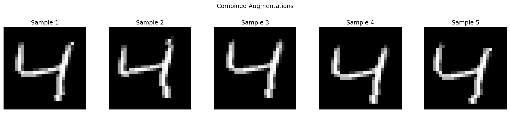

### Individual Samples
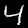 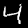 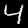 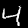 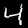 
