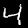
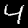
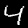
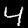
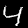

# Augmentations for Digit 4

## Original Image

## Rotation Augmentation

### Individual Samples
     

## Affine Augmentation

### Individual Samples
     

## Combined Augmentation

### Individual Samples
     
