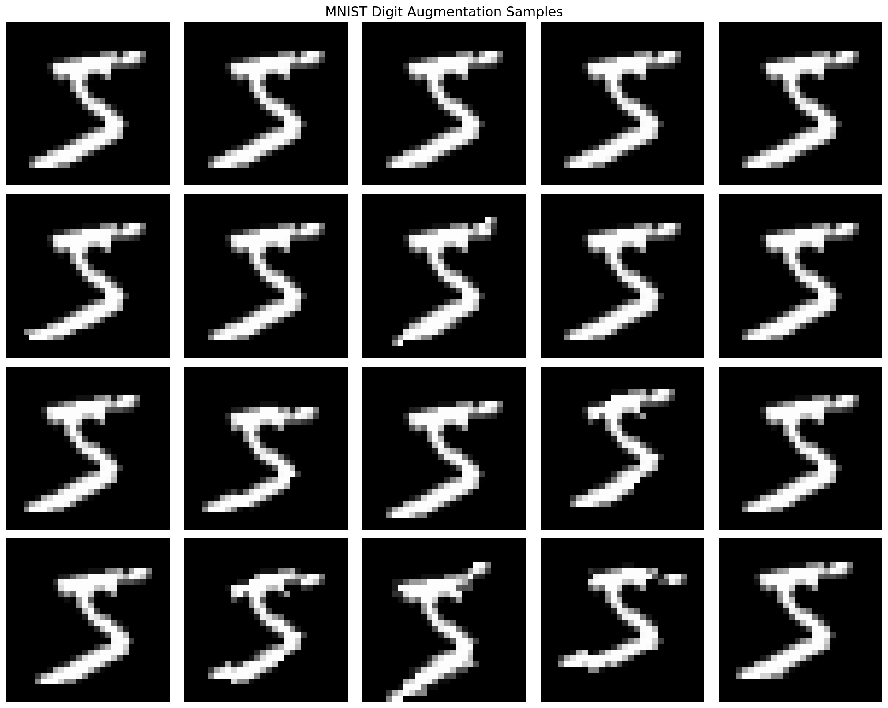

# MNIST Augmentation Samples

This shows different augmentations applied to a single MNIST digit:

- Row 1: Original image
- Row 2: Random rotation (±5°)
- Row 3: Random affine (rotation, translation, scale)
- Row 4: Combined augmentations

